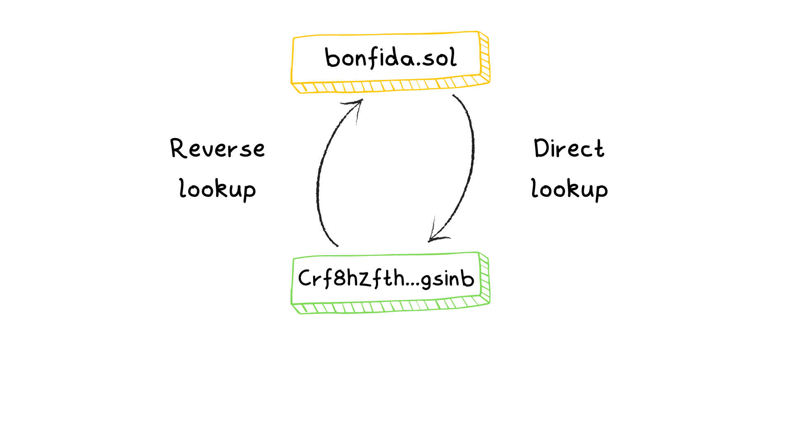

# Direct look up



In order to get the information of a domain name you need to:

1. Get the domain name public key
2. Retrieve the account info

```js
import { getDomainKey, NameRegistryState } from "@bonfida/spl-name-service";

const domainName = "bonfida"; // With or without the .sol at the end

// Step 1
const { pubkey } = await getDomainKey(domainName);

// Step 2
// The registry object contains all the info about the domain name
// The NFT owner is of type PublicKey | undefined
const { registry, nftOwner } = await NameRegistryState.retrieve(
  connection,
  pubkey
);

// Subdomain derivation
const subDomain = "dex.bonfida"; // With or without the .sol at the end
const { pubkey: subKey } = await getDomainKey(subDomain);

// Record derivation (e.g IPFS record)
const record = "IPFS.bonfida"; // With or without the .sol at the end
const { pubkey: recordKey } = await getDomainKey(record, true);
```

The `retrieve` method returns an object made of two fields:

- `registry` is of type `NameRegistryState`
- `nftOwner` is of type `PublicKey | undefined`
  - When `nftOwner` is of type `PublicKey` it means that the domain is tokenized and the current NFT holder is `nftOwner`. When a domain is tokenized `registry.owner` is an escrow account that is program owner. Funds should be sent to `nftOwner`
  - When `nftOwner` is of type `undefined` it means that the domain is not tokenized and funds should be sent to `registry.owner`

> **Note:** `NameRegistryState.retrieveBatch` can be used to retrieve multiple name registries at once.
